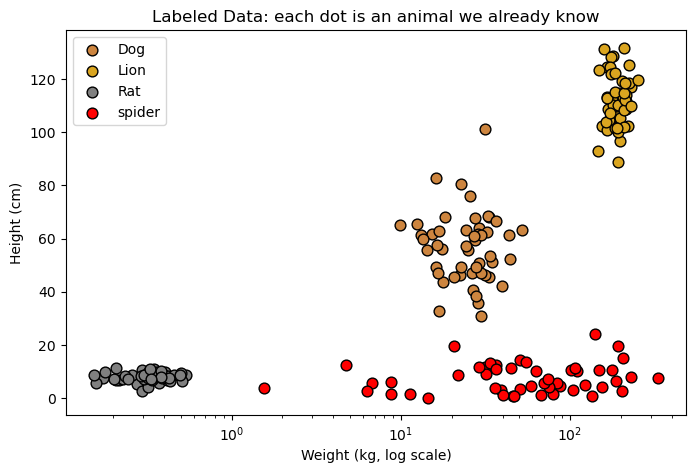
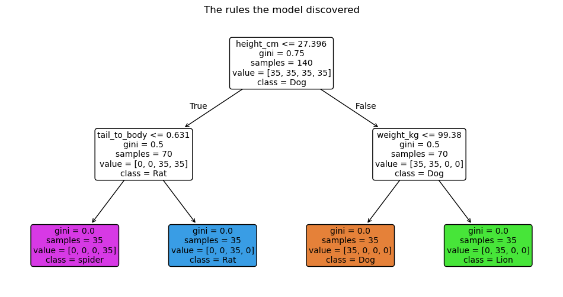
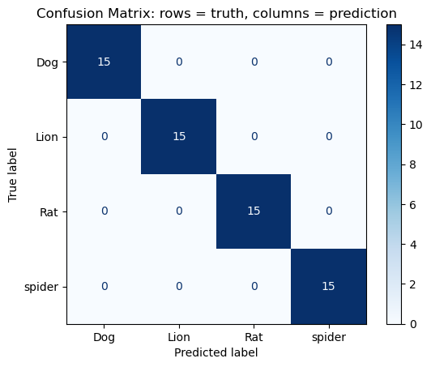

# Supervised Learning: Rat, Dog, or Lion?
**Author:** <<Lloyd Lewis>>
**Course:** CAP 4620 Artificial Intelligence, Florida A&M University
**Date:** <<October 6, 2026>>
**Environment:** NRP JupyterHub, Python 3 (ipykernel)
## Project Description
This project shows how supervised learning works. A model is trained on
animals whose answers (labels) we already know, and then it predicts the
label of animals it has never seen.

## Project Structure
```
Lab1_SupervisedL/
├── data/ # generated datasets and predictions (CSV)
├── figures/ # plots exported from the notebook (PNG)
├── models/ # trained model (.joblib) and model card (.json)
├── README.md
└── SupervisedL.ipynb
```
## Data
The dataset is **synthetic**: it is generated with NumPy (`np.random.seed(42)`),
with 50 examples per animal class.
| Feature | Meaning |
|---|---|
| `weight_kg` | body weight in kilograms |
| `height_cm` | shoulder height in centimeters |
| `tail_to_body` | tail length divided by body length |
**Label:** `animal` (<<list the classes, e.g. Rat, Dog, Lion, spider>>)
| File | Description |
|---|---|
| `data/animals_full.csv` | all generated animals (features + label) |
| `data/train.csv` | training split (70%) |
| `data/test.csv` | test split (30%), hidden during training |
| `data/predictions.csv` | test animals with true vs. predicted label |
## Method
1. Separate features (`X`) from labels (`y`).
2. Split into training (70%) and test (30%) data with `stratify=y`.
3. Train a `DecisionTreeClassifier` (`max_depth = <<value>>`, `random_state = 42`).
4. Predict the test data and evaluate with accuracy, a classification report
and a confusion matrix.
## Model
| File | Description |
|---|---|
| `models/decision_tree.joblib` | the trained Decision Tree |
| `models/model_info.json` | model settings and test accuracy |
Load it with:
```python
import joblib
model = joblib.load("models/decision_tree.joblib")
```
## Results
**Test accuracy:** <<100%>>

*Each dot is an animal. The classes sit in different regions of the plot.*

*The yes/no rule(s) the model learned. First split feature: <<feature>>.*

*Rows = true animal, columns = predicted animal. Most confused classes: <<...>>.*
## Discussion
1. **Why do we need labels?** <<Labels tell the model what each training example represents. In this project, the labels identify whether an animal is a Rat, Dog, or Lion. The model uses these known examples to learn patterns between the animal features and their class. Without labels, the model would not know which category each example belongs to or what it should predict for new data.>>
2. **What would the model predict for a cat, and why is that a problem?** <<The model would most likely classify a cat as a Rat, Dog, or Lion because those are the only classes it was trained to recognize. A cat is not one of the available labels, so the model cannot identify it as a separate class. This shows why a supervised learning model can only make predictions based on the categories represented in its training data.>>
3. **Which feature did the tree use first, and why?** <<The tree used the feature that provided the strongest separation between the animal classes as its first split. For this dataset, weight is likely to be the most useful feature because rats, dogs, and lions have large differences in body weight. This allows the decision tree to separate the classes with fewer decisions.>>
4. **How does `max_depth` affect accuracy?** <<A smaller max_depth limits how many decisions the tree can make. At a depth of 1, the model can make only one main split, which may not be enough to correctly separate all three animal classes. A larger depth gives the tree more opportunities to separate the classes and can improve accuracy. However, making the tree too deep can cause it to memorize the training data instead of learning patterns that generalize well to new animals. The goal is to use enough depth to make accurate predictions without making the model unnecessarily complex.>>
## How to Run
1. Open the project on the NRP JupyterHub.
2. Open `SupervisedL.ipynb` and choose **Run → Run All Cells**.
3. The final cells save the data to `data/` and the model to `models/`.
## Requirements
`numpy`, `pandas`, `matplotlib`, `scikit-learn`, `joblib`
````
> 💡 The image links in the README use **relative paths** (`figures/...`). They work
because `README.md` is in the same folder as `figures/`. Do not use paths like
`/home/jovyan/...`, since they break on GitHub and on other computers.